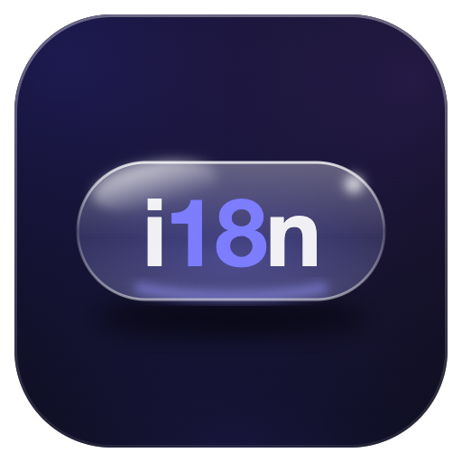

  

# a2o-i18n — i18n 縮寫產生器

[English](#english) | [繁體中文](#繁體中文)

🔗 **Live Demo**: [a2o.kvcc.me](https://a2o.kvcc.me)

---

## English

A tiny toy that compresses every word into its numeronym — `first letter + middle letter count + last letter` — just like **I**nternationalizatio**n** becomes **i18n**. Type a sentence and watch it turn unreadable in real time.

### ✨ Features

- **Live Conversion**: Output updates as you type, punctuation and spacing preserved.
- **One-Click Copy**: Copy the result with a green success feedback.
- **Sample Chips**: Tap a sample sentence to try it instantly.
- **Liquid Glass UI**: Apple-style refractive glass (SVG `feDisplacementMap` + RGB chromatic aberration, after [jh3y's technique](https://codepen.io/jh3y/pen/EajLxJV)) on Chromium, frosted-blur fallback on Safari/Firefox.
- **Light / Dark / Auto Theme**: Follows the system by default; manual override is remembered in `localStorage`.

### 🛠 Tech

- React 18 + Vite
- [liquid-glass-kit](https://github.com/lp250isme/liquid-glass-kit) — `<LiquidGlass>` refraction + frosted glass materials (`--lg-*` design tokens, iOS semantic colors)
- [more-by-kv](https://github.com/lp250isme/more-by-kv) — centralized cross-promo registry + `<MoreByKv>` card list
- Deployed on Vercel

### 🔗 More by kv

- [GTC — Maps Coordinate Converter](https://gtc.kvcc.me/) · [repo](https://github.com/lp250isme/maps-coords-api)
- [Indigo — Playlist Cover Maker](https://indigo.kvcc.me/) · [repo](https://github.com/lp250isme/playlist-cover-maker)

### 🙏 Credit

Inspired by [RimoChan/i7h](https://github.com/RimoChan/i7h).

---

## 繁體中文

一個惡趣味小工具：把每個單字壓縮成「首字母 + 中間字母數 + 尾字母」的縮寫——就像 **I**nternationalizatio**n** 因為中間有 18 個字母而簡寫成 **i18n**。輸入任意句子，即時轉換成讓你完全看不懂的樣子。

### ✨ 功能

- **即時轉換**：邊打邊轉，保留空格與標點。
- **一鍵複製**：複製結果，成功時轉綠勾回饋。
- **範例 chips**：點一下範例句立即試玩。
- **Liquid Glass UI**：Apple 風折射玻璃（SVG `feDisplacementMap` 位移貼圖 + RGB 色散，採用 [jh3y 的技法](https://codepen.io/jh3y/pen/EajLxJV)），Chromium 限定，Safari/Firefox 自動退回霜化模糊玻璃。
- **淺色 / 深色 / 自動主題**：預設跟隨系統，手動切換會記在 `localStorage`。

### 🛠 技術

- React 18 + Vite
- [liquid-glass-kit](https://github.com/lp250isme/liquid-glass-kit) —— `<LiquidGlass>` 折射玻璃 + 霜化玻璃材質（`--lg-*` design token、iOS 語意色）
- [more-by-kv](https://github.com/lp250isme/more-by-kv) —— 集中管理的跨作品註冊表 + `<MoreByKv>` 卡片元件
- 部署於 Vercel

### 🔗 kv 的其他作品

- [GTC — 地圖座標轉換](https://gtc.kvcc.me/) · [repo](https://github.com/lp250isme/maps-coords-api)
- [Indigo — 歌單封面製作](https://indigo.kvcc.me/) · [repo](https://github.com/lp250isme/playlist-cover-maker)

### 🙏 致謝

靈感來自 [RimoChan/i7h](https://github.com/RimoChan/i7h)。
